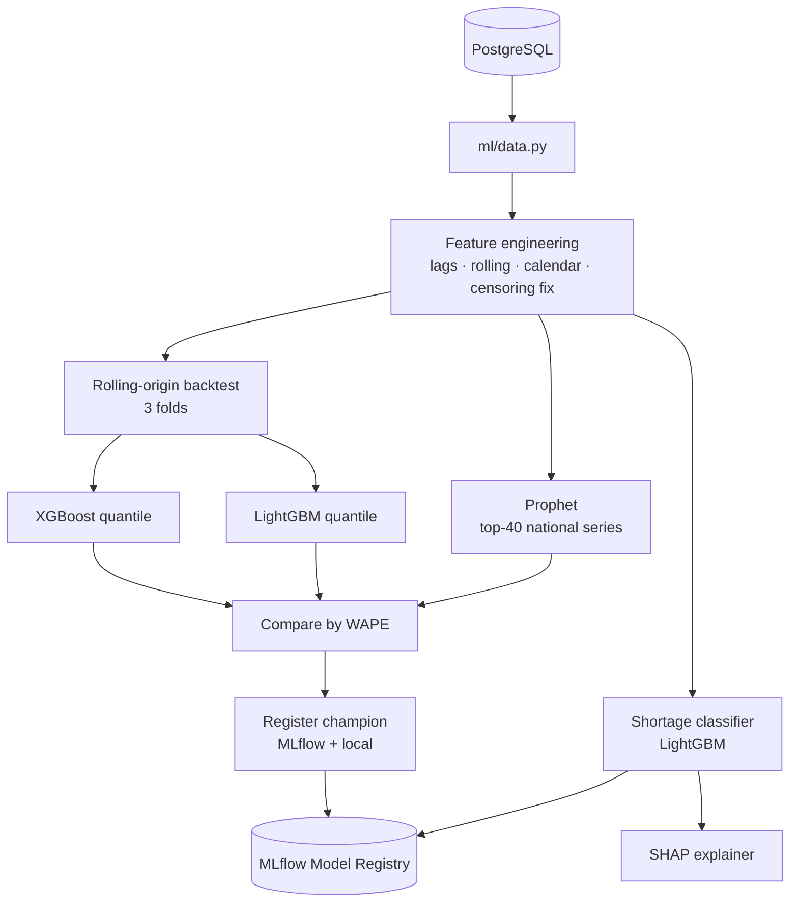
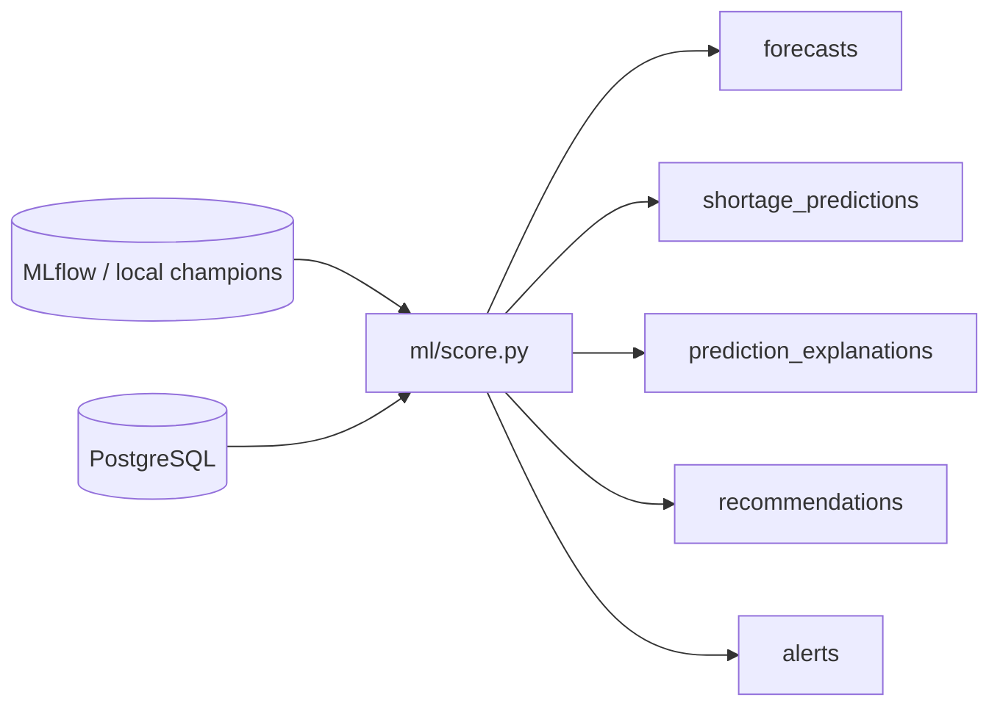
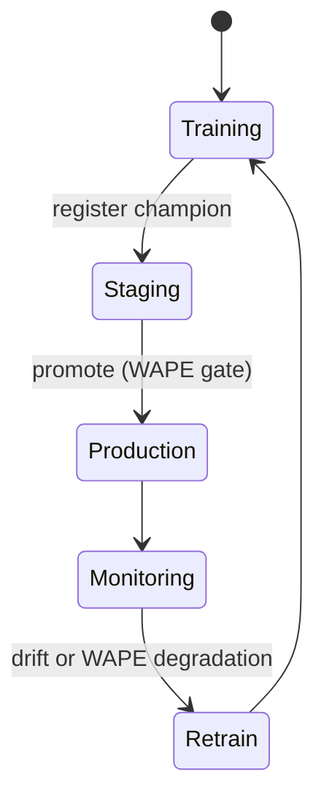

# AI Architecture

## Overview

Two model families, one explainability layer:

1. **Demand forecasting** — predicts total demand over 7 / 14 / 30 / 90-day
   horizons per medication × governorate (plus national aggregate).
2. **Shortage prediction** — a binary classifier estimating the probability of a
   stockout within the horizon, mapped to a 5-level severity scale.
3. **Explainability** — SHAP over the shortage classifier, rendered into
   French/Arabic rationale at scoring time.

## Training pipeline

### Features (demand)
`lag_{1,7,14,28}`, `roll_mean_{7,28,90}`, `roll_std_{7,28}`, day-of-week, month,
weekend flag, `flu_index`, unit price, essential flag, `demand_change_30d`.
Stockout days are **demand-censored** — quantity is imputed from a trailing
average before targets are computed, so shortages don't teach the model that
demand fell.

### Models & metrics
- XGBoost + LightGBM with quantile objectives at 0.1 / 0.5 / 0.9 → point forecast
  + confidence interval.
- Prophet benchmarked on the busiest national series (per-series & slower).
- Champion per horizon chosen by **WAPE**; also tracked: MAPE, RMSE, pinball
  loss, CI coverage. Report at `ml/reports/model_comparison.md`.

## Inference / scoring pipeline

### Severity mapping
| Probability | Severity |
|---|---|
| ≥ 0.80 | 🔴 critical |
| 0.60–0.80 | 🔴 red |
| 0.40–0.60 | 🟠 orange |
| 0.20–0.40 | 🟡 yellow |
| < 0.20 | 🟢 green |

Safety override: an **essential** medication with < 5 days of cover is forced to
`critical` regardless of probability.

## Model lifecycle & monitoring

### Drift detection (design — pass-1 documented, automation deferred)
- **Feature drift**: Population Stability Index (PSI) on key features
  (`demand_mean_28`, `national_coverage_days`) vs the training window; PSI > 0.2
  triggers review, > 0.3 triggers retrain.
- **Performance drift**: rolling WAPE on realized vs predicted demand; a > 20%
  relative degradation vs the champion's backtest triggers retrain.
- Retraining is a scheduled job (weekly) plus event-driven on drift alerts.

## Feature store note
Pass-1 computes features on demand from the transactional tables. The feature
definitions in `ml/features.py` are the contract; a materialized feature store
(e.g. Feast on Redis/Postgres) is a later-pass optimization with no interface
change for consumers.
