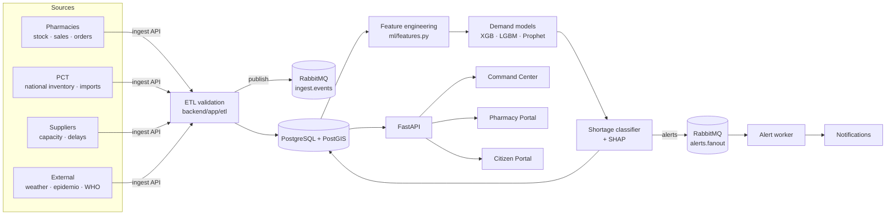
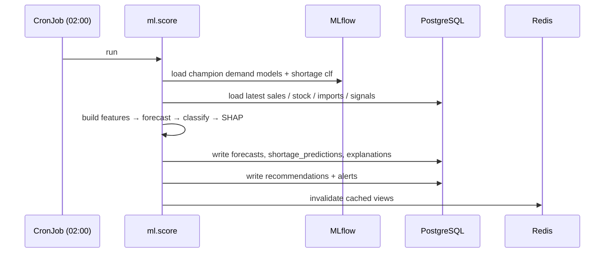

# Data Flow

## Ingestion → prediction → portals

## Batch scoring sequence

## Time budget

| Stage | Cadence | Target |
|---|---|---|
| Ingestion | continuous / hourly batches | < 1s per batch |
| Feature build + train | weekly (or on drift) | < 10 min |
| Scoring refresh | nightly | < 5 min |
| API read (cached) | on demand | < 100 ms p95 |
