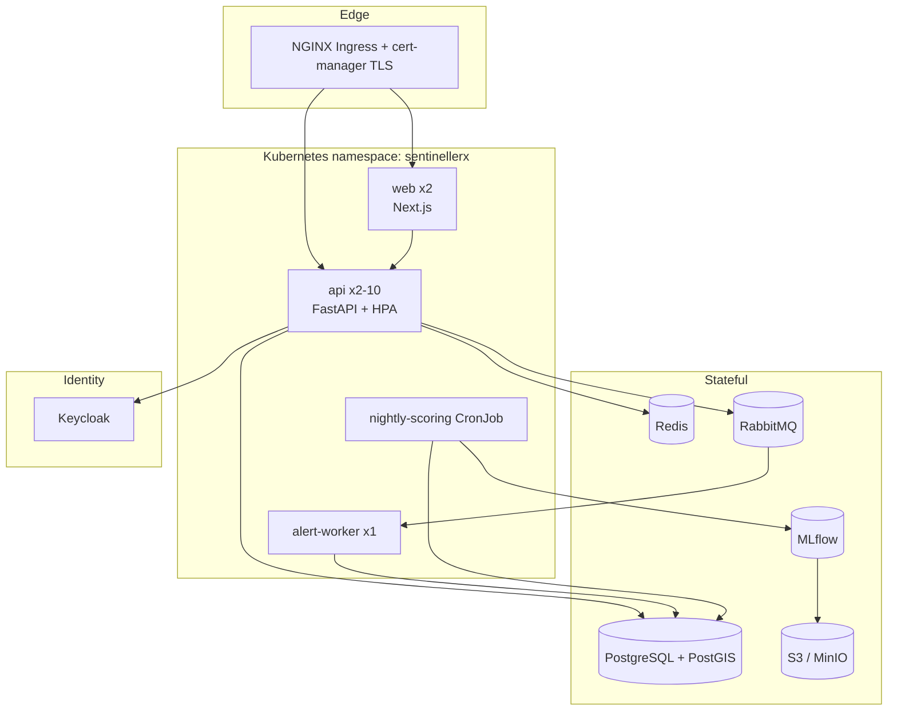

# Deployment & Disaster Recovery

## Topology

## Environments
- **Local**: `docker-compose.yml` — full stack; API/web on host for fast reload.
- **Staging / Production**: `infra/k8s/overlays/{staging,production}` (kustomize).
  Managed Postgres, Redis, RabbitMQ, and object storage recommended over
  in-cluster stateful sets for production.

## Deployment flow
1. Tag `v*` → `docker-build` builds & pushes `api`, `web`, `ml` images to GHCR.
2. `deploy` workflow applies the kustomize overlay (`--dry-run` until a real
   cluster + `KUBE_CONFIG` secret are configured).
3. `alembic upgrade head` runs as an init job before the API rolls out.

## Scaling
- API is stateless behind an HPA (CPU 70%, 2→10 replicas).
- Read-heavy endpoints (`/shortages/map`, `/stock/national`, citizen search) are
  Redis-cached (60 s) and invalidated after each scoring run.
- Time-series tables are indexed for `(medication, date)` / `(medication,
  governorate, horizon)`; `stock_levels` / `sales_daily` are partition-ready by
  month for national-scale volumes.

## Disaster recovery

| Aspect | Strategy |
|---|---|
| **Database** | Nightly `pg_dump` to S3 + continuous WAL archiving (PITR). |
| **RPO** | ≤ 15 min (WAL archiving). |
| **RTO** | ≤ 1 hour (restore latest base backup + replay WAL). |
| **ML artifacts** | Versioned in S3 via MLflow; models are reproducible from data + code. |
| **Object storage** | Bucket versioning + cross-region replication. |
| **Config/secrets** | Managed by ExternalSecrets/Sealed Secrets; recoverable from the secret store. |
| **Runbook** | 1) restore Postgres base + WAL, 2) point services at restored DB, 3) rerun `ml.score` to refresh predictions, 4) verify `/readyz` + dashboards. |

Backups are tested by a scheduled restore drill into an isolated namespace.
