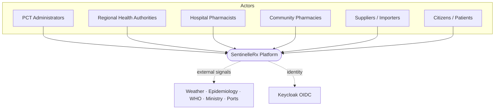
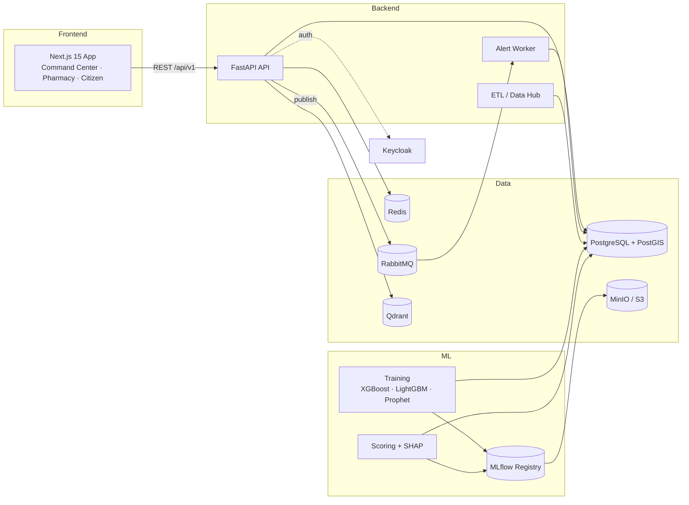

# SentinelleRx — System Overview

SentinelleRx is a national medication-shortage prediction platform for Tunisia.
It ingests supply-chain data, forecasts demand, predicts shortages with
explainable AI, and serves professionally-validated recommendations through
three role-based portals.

## C4 — Context

## C4 — Containers

## Module map

| # | Module | Where it lives |
|---|---|---|
| 1 | National Data Hub (ETL) | `backend/app/etl`, ingestion endpoints, RabbitMQ |
| 2 | Demand Forecasting AI | `ml/ml/training`, `ml/ml/features.py` |
| 3 | Shortage Prediction Engine | `ml/ml/shortage.py`, `ml/ml/score.py` |
| 4 | Explainable AI | `ml/ml/explain.py` (SHAP → FR/AR narrative) |
| 5 | Smart Recommendations | `backend/app/services/recommendations.py` |
| 6 | Substitution Engine | `backend/app/services/substitution.py` |
| 7 | National Command Center | `frontend/src/app/[locale]/cc` |
| 8 | Pharmacy Portal | `frontend/src/app/[locale]/pharmacy` |
| 9 | Citizen Portal | `frontend/src/app/[locale]/(page + medication)` |

## Design principles

- **Explainability first** — every shortage prediction stores a SHAP-derived
  rationale; no black-box decisions reach a user.
- **Human-in-the-loop** — recommendations and substitutions are decision-support;
  a PCT officer or pharmacist validates the final action.
- **Explain at write time** — SHAP runs during scoring, never in the request path.
- **One schema, three consumers** — API, ML, and the seeder share the SQLAlchemy
  models in `backend/app/models`.
